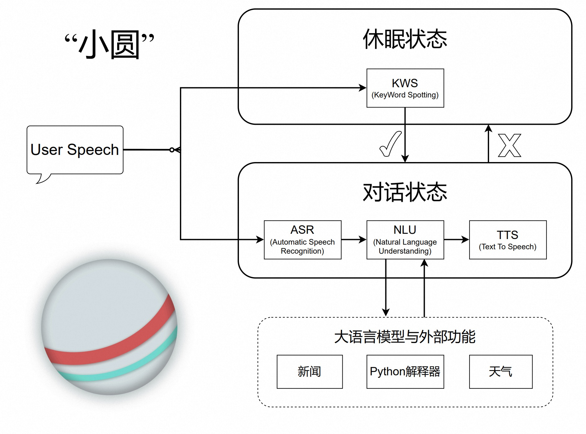

# 语音聊天机器人 🎤🤖

[](https://www.python.org/)
[](LICENSE)

<p align="center">
  
</p>

一个基于终端界面的中文语音聊天机器人，支持自定义唤醒词和实时语音对话。通过语音识别、大语言模型和文本转语音技术，实现自然流畅的语音交互体验。

## 🌟 特色功能

- **自定义唤醒词** - 支持任意中文唤醒词，通过DTW相似度检测技术实现精准识别
- **实时语音对话** - 流式语音识别和文本转语音，实现低延迟自然对话
- **智能助手功能** - 查询天气、新闻，执行数学计算等实用功能
- **精美终端界面** - 彩色动画图标和对话面板，提供愉悦的视觉体验
- **多语言支持** - 自动识别中英文内容并使用相应语音合成模型

## 🚀 快速开始

### 系统要求

- Python 3.8+
- 麦克风和扬声器
- 网络连接（用于API调用）

### 安装步骤

1. 克隆项目代码：
```bash
git clone https://github.com/flateon/ChatBot.git
cd ChatBot
```

2. 安装依赖：
```bash
pip install -r requirements.txt
```

3. 配置API密钥：
在 `keys.py` 文件中填入以下服务的API密钥：
- [DashScope](https://dashscope.aliyun.com/) - 用于ASR、LLM、TTS服务
- [Seniverse](https://www.seniverse.com/) - 用于天气查询
- [TianAPI](https://www.tianapi.com/) - 用于新闻获取
- [ALAPI](https://www.alapi.cn/) - 用于头条新闻

### 运行机器人

```bash
python terminal.py
```

## 🎙️ 使用方法

1. **唤醒机器人** - 说出你自定义的唤醒词（如"小圆小圆"）
2. **开始对话** - 机器人会回应问候语，然后你可以开始提问
3. **功能示例**：
   - 天气查询："今天北京的天气怎么样？"
   - 新闻获取："告诉我一些科技新闻"
   - 数学计算："根号2等于多少？"
4. **结束对话** - 长时间不说话会自动退出对话状态

## 🏗️ 系统架构

<p align="center">
  
</p>

### 核心模块

1. **关键词检测 (KWS)** - 使用Wav2Vec2模型和DTW距离测量检测唤醒词
2. **语音识别 (ASR)** - 基于Paraformer模型的流式语音转文本
3. **语言理解 (LLM)** - 通义千问大语言模型处理用户意图
4. **语音合成 (TTS)** - Sambert-Hifigan模型实现自然语音输出


## 🛠️ 开发指南

### 项目结构
```
chatbot/
├── KWS.py          # 关键词检测模块
├── asr.py          # 语音识别模块
├── llm.py          # 大语言模型模块
├── tts.py          # 文本转语音模块
├── terminal.py     # 主程序入口
├── plugins.py      # 外部API插件
├── prompts.py      # 系统提示词
├── draw.py         # 终端绘图工具
├── kws_model.py    # KWS模型定义
├── utils/          # 工具函数
└── Records/        # 音频模板文件
```

### 测试
```bash
# 运行提示词测试
python -m unittest tests/test_prompt.py
```

## ▶️ 演示视频

https://github.com/user-attachments/assets/99f436a0-8042-4167-8de3-8320b0784760


## 📄 许可证

本项目采用MIT许可证 - 查看 [LICENSE](LICENSE) 文件了解详情

## 🙏 致谢
- 感谢DashScope提供的ASR/LLM/TTS API服务
- 感谢Seniverse和TianAPI提供的天气和新闻数据
- 感谢Rich库提供的终端美化功能
